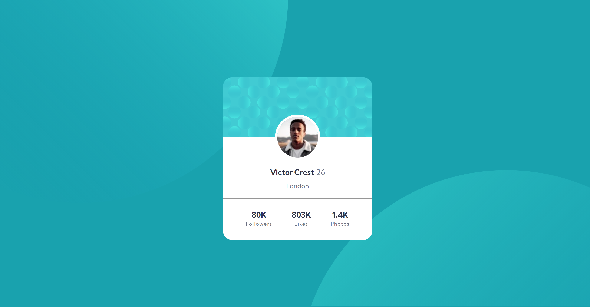

# Frontend Mentor - Profile card component solution

This is a solution to the [Profile card component challenge on Frontend Mentor](https://www.frontendmentor.io/challenges/profile-card-component-cfArpWshJ). Frontend Mentor challenges help you improve your coding skills by building realistic projects. 

## Table of contents

- [Overview](#overview)
  - [The challenge](#the-challenge)
  - [Screenshot](#screenshot)
  - [Links](#links)
- [My process](#my-process)
  - [Built with](#built-with)
  - [What I learned](#what-i-learned)
- [Author](#author)

## Overview

### The challenge

- Build out the project to the designs provided

### Screenshot

### Links

- Solution URL: https://www.frontendmentor.io/solutions/profile-card-component-with-html-and-css-Cb16usePF
- Live Site URL: https://viktoria-zsolnai.github.io/profile-card-component-main/

## My process

### Built with

- HTML5
- CSS 
- Flexbox

### What I learned

- Learned about SVG files

## Author

- Website - [viktoria.zsolnai](https://viktoria-zsolnai.github.io/)
- Frontend Mentor - [@viktoria-zsolnai](https://www.frontendmentor.io/profile/viktoria-zsolnai)
